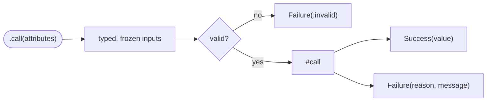
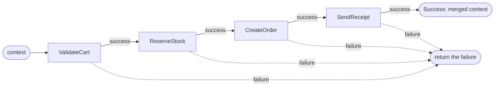

<p align="center">
  
</p>

<p align="center">
  <a href="https://rubygems.org/gems/serviced"></a>
  = 3.1">
  <a href="LICENSE.txt"></a>
</p>

**Serviced** organizes your business logic into small, explicit service objects. Inputs are typed, immutable, and validated. Every call returns an honest `Success` or `Failure`. Services compose into flows that run with or without a transaction. That is the whole gem.

```ruby
class RegisterUser < Serviced::Service
  attribute :email,    :string
  attribute :password, :string
  attribute :plan,     :string, default: "free"

  validates :email, presence: true, format: { with: URI::MailTo::EMAIL_REGEXP }
  validates :password, length: { minimum: 8 }

  def call
    success(User.create!(email:, password:, plan:))
  rescue ActiveRecord::RecordNotUnique
    failure(:email_taken, "That email is already registered")
  end
end

RegisterUser.call(email: "ada@example.com", password: "correct horse")
  .on_success { |user| UserMailer.welcome(user).deliver_later }
  .on_failure { |failure| Rails.logger.warn(failure.message) }
```

## Table of contents

- [Why serviced](#why-serviced)
- [Installation](#installation)
- [Getting started](#getting-started)
- [Services](#services)
  - [Typed inputs](#typed-inputs)
  - [Immutability that actually holds](#immutability-that-actually-holds)
  - [Validation](#validation)
- [Results](#results)
  - [Callbacks, chaining, and pattern matching](#callbacks-chaining-and-pattern-matching)
- [Flows](#flows)
  - [Transactions](#transactions)
- [Queries](#queries)
- [Cookbook](#cookbook)
- [Configuration](#configuration)
- [Testing your services](#testing-your-services)
- [Philosophy](#philosophy)
- [Contributing](#contributing)
- [License](#license)

## Why serviced

Business logic has to live somewhere. Left alone, it spreads across fat controllers and fatter models: params get coerced by hand, validations happen in three places, and the return value of a "service" might be a record, a boolean, `nil`, or an exception depending on the day.

```ruby
# Before: everything in the controller
def create
  amount = params[:amount].to_i
  return render_error("amount required") if amount <= 0

  from = Account.find(params[:from_id])
  to   = Account.find(params[:to_id])
  return render_error("insufficient funds") if from.balance_cents < amount

  ActiveRecord::Base.transaction do
    from.update!(balance_cents: from.balance_cents - amount)
    to.update!(balance_cents: to.balance_cents + amount)
    Ledger.create!(from:, to:, amount_cents: amount)
  end
  redirect_to account_path(from)
rescue => e
  render_error(e.message)
end
```

```ruby
# After: the controller delegates, the contract lives in the flow
def create
  TransferFunds.call(from_id: params[:from_id], to_id: params[:to_id], amount_cents: params[:amount])
    .on_success { |ctx| redirect_to account_path(ctx[:from]) }
    .on_failure { |failure| render_error(failure.message) }
end
```

The typing, the validation, the branching, and the transaction now live in one named, testable place. That is what serviced gives you:

1. **Typed, immutable inputs.** Declared with types, coerced on the way in, frozen afterwards. The contract lives in the service, not the controller.
2. **A mandatory Success/Failure result.** No guessing what a call returns.
3. **Composable flows.** Chain services into a pipeline, with or without a single transaction.
4. **Query objects.** A typed home for the gnarly reads, returning a composable relation.

## Installation

```ruby
# Gemfile
gem "serviced"
```

```sh
bundle install
```

Serviced depends only on `activemodel`, so it works in any Ruby project. The transactional flow feature uses ActiveRecord when it is available (see [Configuration](#configuration)).

## Getting started

A service declares its inputs, validates them, and implements `#call`. `#call` must return a result, built with the `success` and `failure` helpers.

```ruby
class SubscribeToNewsletter < Serviced::Service
  attribute :email, :string

  validates :email, presence: true, format: { with: URI::MailTo::EMAIL_REGEXP }

  def call
    subscriber = Subscriber.find_or_initialize_by(email:)
    return failure(:already_subscribed) if subscriber.persisted?

    subscriber.save!
    success(subscriber)
  end
end
```

Call it with a hash of attributes. You always get back a result.

```ruby
result = SubscribeToNewsletter.call(email: "grace@example.com")

result.success?  # => true
result.value     # => #<Subscriber ...>

# an invalid call never reaches #call:
SubscribeToNewsletter.call(email: "nope").failure? # => true
```

## Services

### Typed inputs

Attributes are declared with the ActiveModel attribute DSL, so string params from a request are coerced to the type you asked for.

```ruby
class BuildReport < Serviced::Service
  attribute :account_id, :integer
  attribute :from,       :date
  attribute :limit,      :integer, default: 50
  attribute :verbose,    :boolean, default: false
  attribute :tags       # no type: accepts any object
end

report = BuildReport.new(account_id: "42", from: "2026-01-01", verbose: "1")
report.account_id # => 42          (Integer)
report.from       # => Date        (Date)
report.verbose    # => true        (TrueClass)
report.limit      # => 50          (default)
```

Unknown keys are ignored, which is what lets a service drop cleanly into a [flow](#flows) without matching the exact shape of the context.

### Immutability that actually holds

Inputs are read-only. There is no writer to reassign them:

```ruby
report.limit = 100 # => NoMethodError: private method 'limit=' called
```

More importantly, inputs are **isolated by default**. At construction each value is captured as an immutable snapshot, so a mutation somewhere else in the code cannot reach into your service and change what it already read.

```ruby
class CalculateQuote < Serviced::Service
  attribute :items # array of { name:, cents: }

  def call
    success(total_cents: items.sum { |item| item[:cents] })
  end
end

cart  = [{ name: "Keyboard", cents: 8_900 }]
quote = CalculateQuote.new(items: cart)

cart << { name: "Surprise fee", cents: 9_900 } # a bug elsewhere mutates the caller's array
quote.items # => [{ name: "Keyboard", cents: 8900 }]  the snapshot is untouched
quote.items << {} # => FrozenError
```

Arrays, hashes, sets, and strings are deep-copied and deep-frozen. Objects with identity (an ActiveRecord record, say) are shared by reference and left alone, because a copy of a record is a different, unsaved object. When you deliberately want to share a mutable value, opt out:

```ruby
class CollectWarnings < Serviced::Service
  attribute :row
  attribute :warnings, isolate: false # shared: the caller reads it back

  def call
    warnings << "missing email" if row[:email].blank?
    success(row)
  end
end
```

### Validation

Use the full ActiveModel validation DSL. Invalid inputs never reach your `#call`. They short-circuit to a failure whose `reason` is `:invalid` and whose `error` is the `ActiveModel::Errors` object.

```ruby
class CreateProject < Serviced::Service
  attribute :name, :string
  attribute :budget_cents, :integer

  validates :name, presence: true
  validates :budget_cents, numericality: { greater_than: 0 }

  def call
    success(Project.create!(name:, budget_cents:))
  end
end

result = CreateProject.call(name: "", budget_cents: -5)
result.reason              # => :invalid
result.error.full_messages # => ["Name can't be blank", "Budget cents must be greater than 0"]
```

## Results

A result is always a `Serviced::Success` or a `Serviced::Failure`, and it is frozen. Here is how a service resolves:



| Method                  | Success        | Failure                          |
| ----------------------- | -------------- | -------------------------------- |
| `success?` / `failure?` | `true`/`false` | `false`/`true`                   |
| `value`                 | the payload    | `nil`                            |
| `value!`                | the payload    | raises `InvalidResultAccess`     |
| `reason`                | not defined    | a `Symbol` for branching         |
| `message`               | not defined    | a `String` or `nil`              |
| `error`                 | not defined    | an exception, error object, etc. |

Build them inside a service with the `success` and `failure` helpers:

```ruby
success(order)                          # a value
success(order: order)                   # a hash value (feeds a flow context)
failure(:sold_out)                      # reason only
failure(:sold_out, "No tickets left")   # reason plus message
failure(:declined, "Card declined", error: gateway_error)
```

### Callbacks, chaining, and pattern matching

```ruby
# Callbacks return self, so they chain
result.on_success { |value| ... }.on_failure { |failure| ... }

# Railway chaining: runs only while successful
CreateProject.call(params)
  .and_then { |project| InviteOwner.call(project:) }
  .and_then { |project| SeedDefaultTasks.call(project:) }

# Transform a success value
CreateProject.call(params).map { |project| ProjectPresenter.new(project) }

# Pattern matching
case PlaceOrder.call(cart:)
in Serviced::Success(value:)
  redirect_to order_path(value)
in Serviced::Failure(reason: :sold_out)
  redirect_to waitlist_path
in Serviced::Failure(reason:, message:)
  render_error(message)
end
```

Controllers get a lot quieter:

```ruby
def create
  PlaceOrder.call(cart: current_cart, payment_token: params[:token])
    .on_success { |ctx| redirect_to order_path(ctx[:order]) }
    .on_failure { |failure| render_error(failure.message, status: status_for(failure.reason)) }
end
```

## Flows

A flow runs steps in order. Each step receives the current context and, on success, contributes a hash that is merged into the context for the next step. The first failing step halts the flow and its failure is returned.

```ruby
class PlaceOrder < Serviced::Flow
  step ValidateCart    # success(cart: cart)
  step ReserveStock    # reads :cart, success(reservation: ...)
  step CreateOrder     # success(order: order)
  step SendReceipt
end

result = PlaceOrder.call(cart: current_cart)
result.value # => { cart: #<Cart>, reservation: ..., order: #<Order> }
```



A step is anything that responds to `call(context)` and returns a result, so a lambda works too:

```ruby
class PlaceOrder < Serviced::Flow
  step ValidateCart
  step ->(context) { Serviced::Success.new(context.merge(audited_at: Time.current)) }
end
```

You can also build a flow inline:

```ruby
PlaceOrder = Serviced::Flow.define do
  step ValidateCart
  step ReserveStock
end
```

### Transactions

Mark a flow `transactional` and every step runs inside one database transaction. If any step returns a failure or raises, the whole thing rolls back. This is the textbook money transfer, done right:

```ruby
class LoadAccounts < Serviced::Service
  attribute :from_id, :integer
  attribute :to_id,   :integer

  def call
    success(from: Account.find(from_id), to: Account.find(to_id))
  end
end

class EnsureFunds < Serviced::Service
  attribute :from
  attribute :amount_cents, :integer

  def call
    return failure(:insufficient_funds, "Not enough balance") if from.balance_cents < amount_cents

    success
  end
end

class TransferFunds < Serviced::Flow
  transactional

  step LoadAccounts
  step EnsureFunds
  step Debit          # from.update!(balance_cents: from.balance_cents - amount_cents)
  step Credit         # to.update!(balance_cents: to.balance_cents + amount_cents)
  step RecordLedger
end

TransferFunds.call(from_id: 1, to_id: 2, amount_cents: 5_00)
```

If `Credit` fails or `RecordLedger` raises, the debit is rolled back. Expected failures roll back and return the failure. Unexpected exceptions roll back and propagate, so bugs stay visible.

## Queries

A query object is a typed home for a complex read. It returns an `ActiveRecord::Relation` (or a value) instead of a result, so what comes back stays composable: callers can still paginate it, add includes, or chain more scopes.

```ruby
class OverdueInvoicesQuery < Serviced::Query
  attribute :account
  attribute :as_of, :date
  attribute :min_cents, :integer, default: 0

  validates :as_of, presence: true

  def call
    account.invoices
           .unpaid
           .where(total_cents: min_cents..)
           .where(due_on: ...as_of)
           .order(:due_on)
  end
end

relation = OverdueInvoicesQuery.call(account:, as_of: Date.current)
relation.page(params[:page]).per(25) # still a relation
```

Invalid inputs raise `Serviced::InvalidQuery` (a query has no failure channel, so bad input is a bug). For queries that drop into raw SQL, the base ships safe helpers so you stop hand-rolling `connection.quote`:

```ruby
class RankedProductsQuery < Serviced::Query
  attribute :scope
  attribute :order_by, :string, default: "created_at"

  def call
    scope.order(Arel.sql("#{quote_column(order_by)} DESC"))
  end

  def total
    count_of(scope) # SELECT COUNT(*) FROM (<scope>) without loading rows
  end
end
```

Keep the split clean: a query reads and returns a relation, a service does something and returns a result. A service consumes a query and wraps it, which is also how a query reaches a flow (through the service, since a step returns a result).

## Cookbook

Short, real recipes across common domains.

**Onboard a new team (flow).**

```ruby
class OnboardTeam < Serviced::Flow
  step CreateAccount    # success(account: account)
  step CreateOwner      # reads :account, success(owner: owner)
  step SeedSampleData
  step SendWelcomeEmail
end
```

**Publish a blog post, atomically (transactional flow).**

```ruby
class PublishPost < Serviced::Flow
  transactional

  step ValidateDraft
  step RenderMarkdown   # success(html: html)
  step MarkPublished    # post.update!(published_at: Time.current)
  step PingSearchIndex
end
```

**Cancel a subscription with a refund (transaction protects both writes).**

```ruby
class CancelSubscription < Serviced::Flow
  transactional

  step LoadSubscription
  step RefundLastCharge  # failure(:refund_failed, ...) rolls everything back
  step EndSubscription
end
```

**Import a CSV row (service with a shared error sink).**

```ruby
class ImportContactRow < Serviced::Service
  attribute :row
  attribute :errors, isolate: false # shared: the importer collects these

  validates :row, presence: true

  def call
    contact = Contact.new(name: row["name"], email: row["email"])
    return failure(:invalid_row, error: contact.errors) unless contact.save

    success(contact)
  end
end
```

**Guard, then act (railway chaining without a flow).**

```ruby
AuthorizePayment.call(order:)
  .and_then { |auth| CapturePayment.call(auth:) }
  .and_then { |charge| FulfillOrder.call(charge:) }
  .on_failure { |failure| NotifyOps.call(failure:) }
```

## Configuration

Transactional flows need a transaction handler. When ActiveRecord is loaded, serviced defaults to `ActiveRecord::Base.transaction`, so a Rails app needs no setup. To use a different mechanism, configure one:

```ruby
Serviced.configure do |config|
  config.transaction_handler = ->(&block) { Sequel::DATABASE.transaction(&block) }
end
```

The handler must run the block inside a transaction and roll back when the block raises. If a transactional flow runs without a handler, it raises `Serviced::MissingTransactionHandler`.

## Testing your services

Services are plain objects with a single entry point, so they are a pleasure to test. Assert on the result, not on side effects you had to reach for.

```ruby
RSpec.describe TransferFunds do
  it "moves money between accounts" do
    from = create(:account, balance_cents: 10_00)
    to   = create(:account, balance_cents: 0)

    result = described_class.call(from_id: from.id, to_id: to.id, amount_cents: 4_00)

    expect(result).to be_success
    expect(from.reload.balance_cents).to eq(6_00)
    expect(to.reload.balance_cents).to eq(4_00)
  end

  it "does not move money when funds are short" do
    from = create(:account, balance_cents: 1_00)
    to   = create(:account, balance_cents: 0)

    result = described_class.call(from_id: from.id, to_id: to.id, amount_cents: 9_00)

    expect(result).to be_failure
    expect(result.reason).to eq(:insufficient_funds)
    expect(from.reload.balance_cents).to eq(1_00) # rolled back
  end
end
```

## Philosophy

- Inputs are read-only, isolated value objects. Compute derived state in `#call`, do not mutate inputs.
- `#call` must return a result. Returning anything else raises `Serviced::ResultTypeError`, so the contract cannot break by accident.
- Validation failures are results, not exceptions, keeping the "always returns a result" guarantee. Genuine programming errors still raise.
- A flow rebuilds its context at each step rather than mutating it, so one step can never quietly change data another step already read.
- Services and queries share one input engine, `Serviced::Typed`. Include it in any plain object to get the same coerced, immutable, validatable attributes.

## Contributing

Bug reports and pull requests are welcome. To hack on the gem:

```sh
bin/setup        # install dependencies
bundle exec rake # run the specs and RuboCop
```

## License

Released under the [MIT License](LICENSE.txt).
